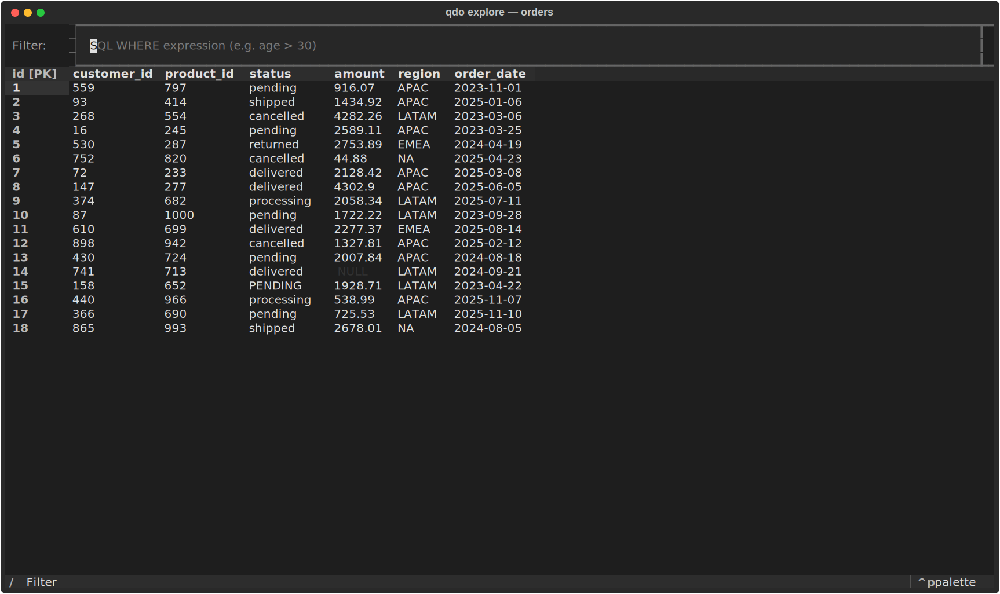
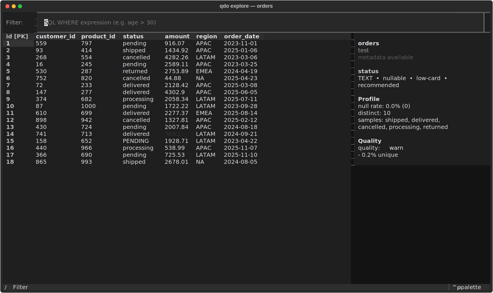
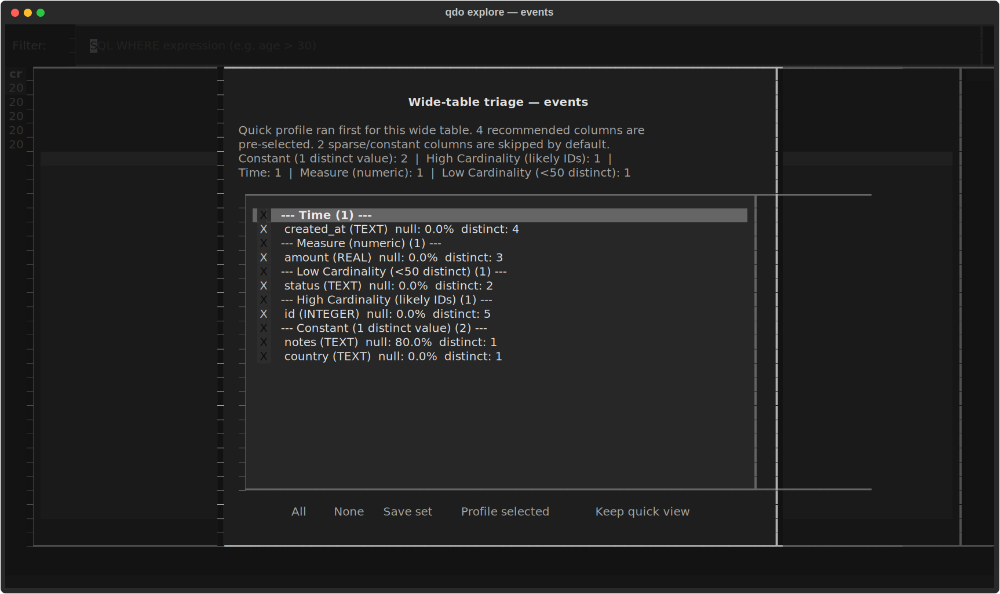

# Examples

This directory contains curated example artifacts for qdo.

The first canonical example is an `orders` table hand-off report built from the
repository's test DuckDB database plus enriched metadata. It exists for two
reasons:

- to show users what a polished `qdo report table` output looks like
- to give development a stable visual target for future output-polish work

## Contents

- `config/connections.toml` — sample connection config used to regenerate the report
- `metadata/test/orders.yaml` — enriched source metadata for the example table
- `reports/orders-report.html` — generated single-file report artifact
- `screenshots/explore-orders-main.svg` — main `qdo explore` grid on the test `orders` table
- `screenshots/explore-orders-sidebar.svg` — sidebar/detail view for the selected `status` column
- `screenshots/explore-wide-triage.svg` — wide-table triage flow used before full profiling

## Regenerate

From the repo root:

```bash
QDO_CONFIG=docs/examples/config \
QDO_METADATA_DIR=docs/examples/metadata \
uv run qdo report table -c test -t orders -o docs/examples/reports/orders-report.html

env UV_CACHE_DIR=/tmp/uv-cache \
uv run python scripts/generate_tui_screenshots.py
```

## TUI screenshots

### Main grid



### Sidebar with selected-column context



### Wide-table triage before full profiling



## Notes

- The example uses `data/test.duckdb`, which is part of the repository.
- The TUI screenshots use `data/test.db` plus a small generated SQLite demo for the wide-table state.
- The metadata file is intentionally richer than the default scaffold so the
  report demonstrates descriptions, valid values, PII flags, ownership, and
  known data-quality caveats.
